# Conduit：SSH、Mosh 与 SFTP

> [!CAUTION]
> Android 正走向封闭。[帮助保持它的开放性](https://keepandroidopen.org)。

一款注重隐私的现代 SSH、Mosh 和 SFTP 客户端，支持 Android 和 iOS。

Conduit 让你直接从手机连接远程主机，无需登录任何账号。主机信息、密钥和已信任的指纹全部存储在本地，完全离线、无需注册、免费使用。你可以打开普通的 SSH shell，也可以使用 Mosh 会话——后者能在 Wi-Fi 断连或切换移动网络时保持连接。会话以标签页形式管理，屏幕上配有修饰键、方向键和功能键，用来弥补手机键盘的缺失。每台主机还可以单独配置 tmux 集成，连接时自动接入已有会话或新建会话，同时支持指定工作目录；按键栏内还内置了 tmux 前缀键、常用快捷键和翻页操作。

此外，项目还提供 SFTP 文件浏览器、主机密钥手动信任机制、可选的设备锁（支持指纹/面容等设备认证），以及多款内置终端主题（Catppuccin、Tokyo Night、Gruvbox、Nord 等），后续还将加入电子墨水屏支持。

Mosh 功能基于 [dart_mosh](https://github.com/gwitko/dart_mosh) 构建，这是用 Dart 从头实现的 Mosh 协议栈；终端模拟器采用 [conduit_vt](https://github.com/gwitko/conduit_vt)，fork 自 xterm.dart。

## 功能列表

- SSH 终端会话：保存主机配置，支持标签筛选与搜索，可按最近连接、名称或添加时间排序，多标签页并行工作。
- Mosh 会话：Wi-Fi 断开或网络切换后自动恢复连接。
- 每台主机独立配置 tmux 集成：自动接入已有会话或新建会话，指定工作目录，自定义前缀键、快捷键和翻页操作。
- SFTP 文件浏览器：浏览、下载、上传、重命名和删除文件。
- 支持 OpenSSH 私钥、密码、硬件安全密钥及服务端驱动的外部认证方式。
- 从文件导入私钥，或直接在设备上生成 `ed25519` 密钥，支持 passphrase 加密，可一键复制或导出公钥。
- 支持 OpenSSH FIDO 安全密钥认证（`ed25519-sk` / `ecdsa-sk`），已在 YubiKey 上验证，兼容 CTAP 规范密钥。
- Android 支持 USB 和 NFC 硬件密钥认证；iOS 支持 NFC 硬件密钥认证。
- SSH Agent 转发可按主机单独开启；私钥与硬件密钥均可转发，远端主机可凭此继续跳转至后续节点，硬件密钥每次仍需物理认证。
- 主机密钥信任管理：首次连接时需手动核查指纹。
- 可自定义屏幕按键行：修饰键、方向键、功能键、长按连发、粘滞键，以及自定义文本和 Ctrl 组合键。
- 可选应用锁：通过设备认证保护已保存的主机信息和凭据。
- 内置多款终端主题，可调字体大小、配色和外观。
- 本地优先：数据全离线存储，无需注册，永久免费。

## 贡献者

Conduit 在社区的共同参与下持续改进。致谢详见 [CONTRIBUTORS.md](CONTRIBUTORS.md)。

## 截图

  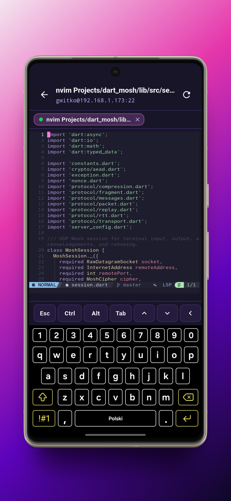
  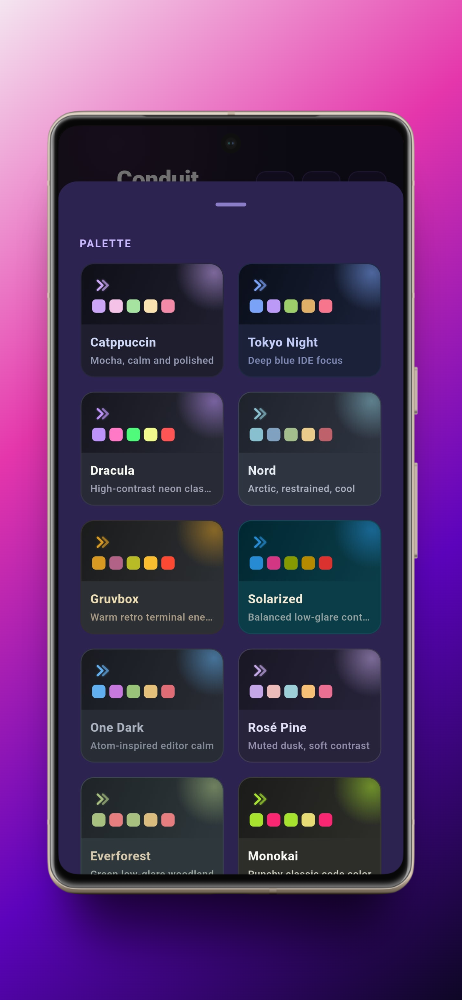
  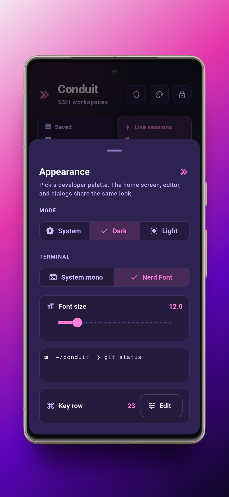
  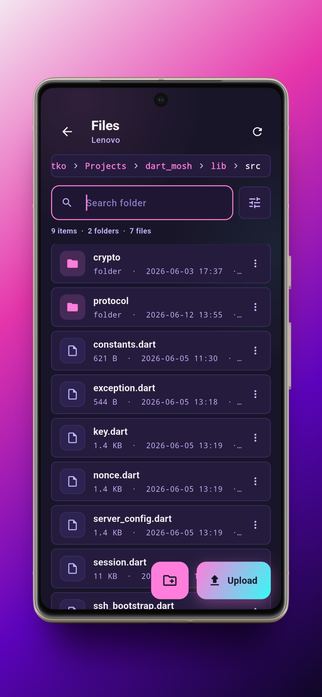

  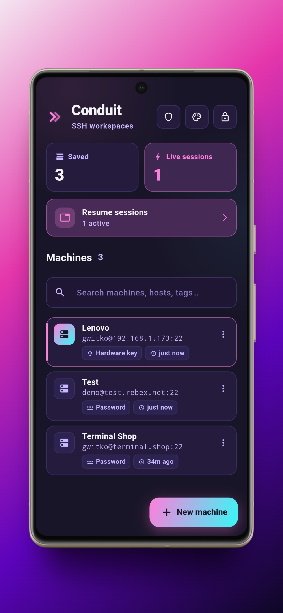
  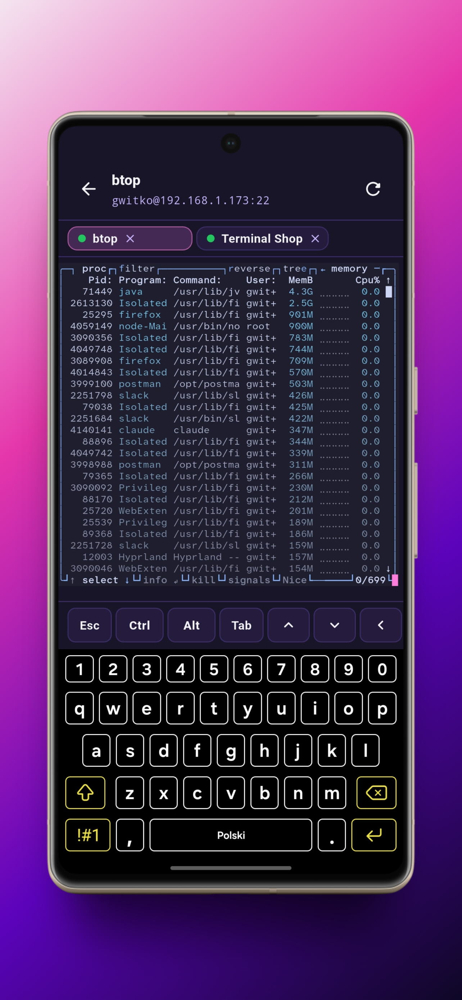
  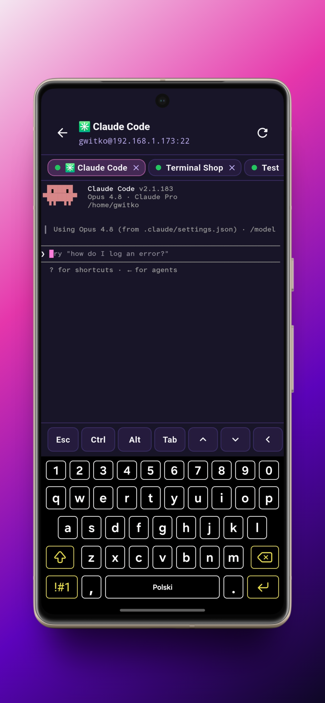
  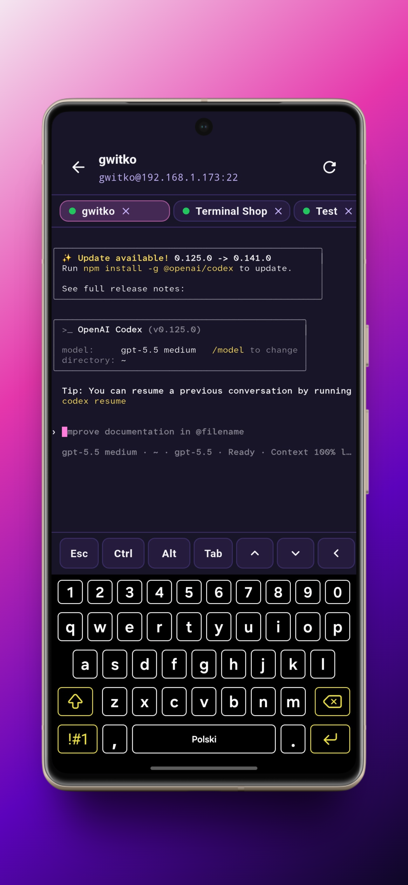

  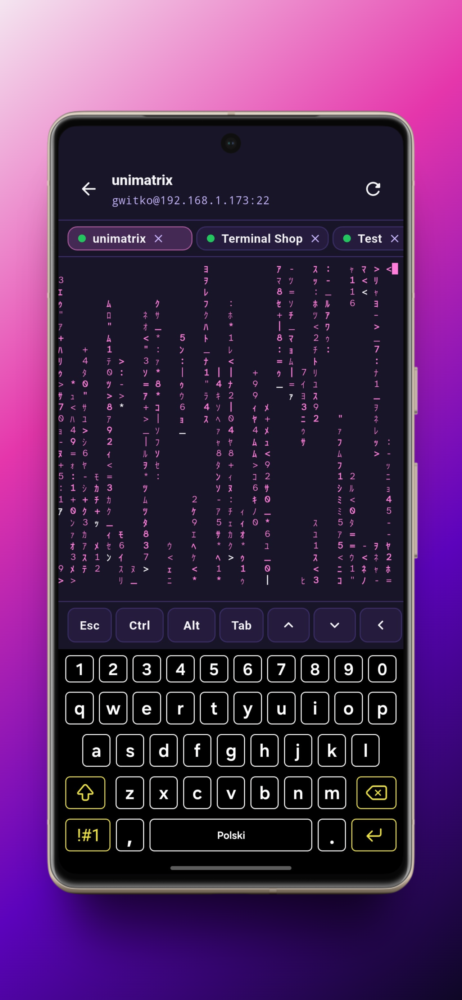
  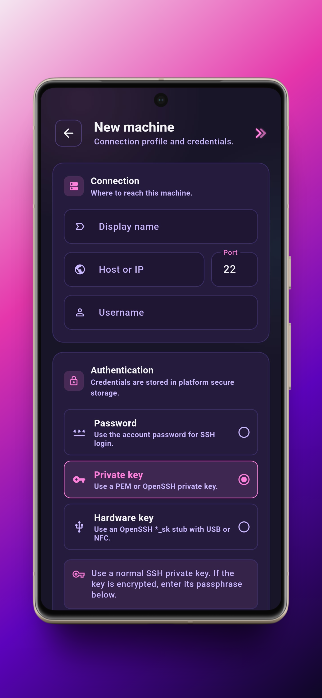
  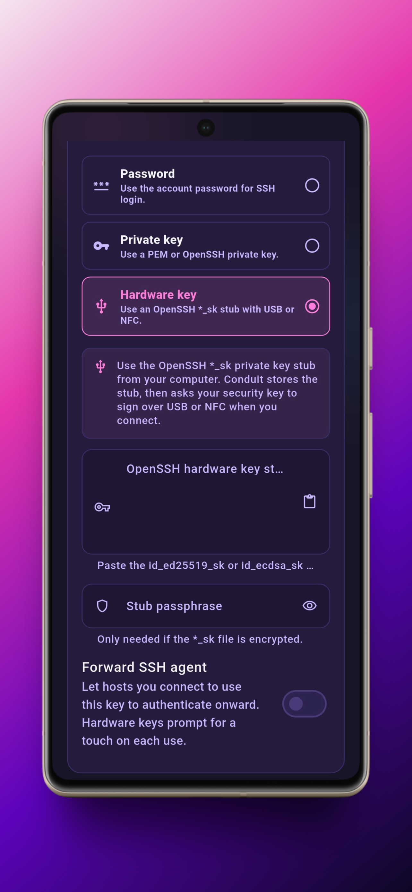
  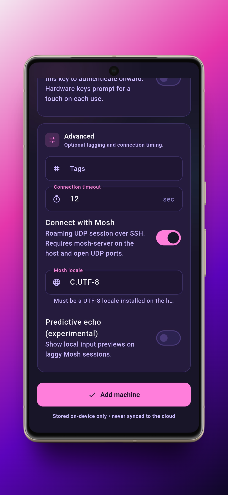

